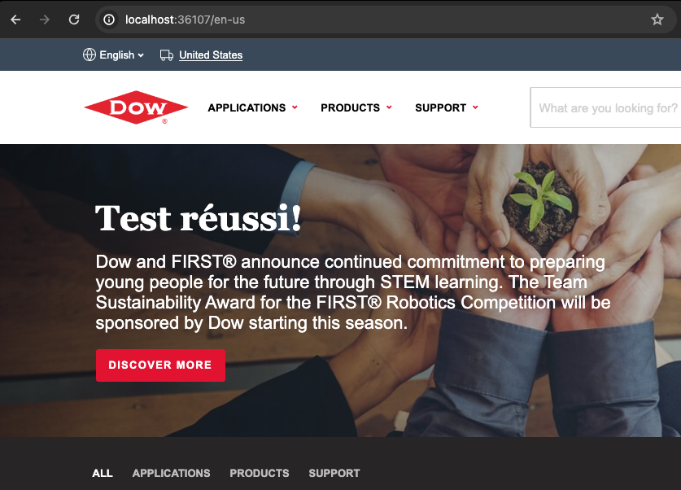

# Dow Bun-proxy

This project is a proxy made with [Bun](https://bun.sh/).

This is the [Ismaël Guerrib](https://github.com/ismaelguerrib/) answer to a technical challenge.

# Installation steps of the project

Follow the [INSTALL.md](INSTALL.md)

# Instructions of the challenge

Nous devons aider l'équipe sales pour une démo client, ils utilisent une technologie qui n'est pas courante: [Bun](https://bun.sh/)

Il va falloir l'installer et apprendre à l'utiliser pour intégrer notre solution

Etape 1: créer un proxy qui permet d'afficher le site du client (www.dow.com) _correctement_ via le serveur local Bun

Résultat:

Etape 2: créer une version avec `/fr-fr` au lieu de `/en-us` dans l'URL.

Toutes les pages qui commencent normalement par `/en-us/*` seront maintenant aussi accessibles sur `/fr-fr/*`

Etape 3: utiliser `dictionary.json` pour traduire n'importe quel mot sur le site affiché sur la version `/fr-fr/*` seulement

Résultat:

Etape 4: on pourrait naviguer sur `/fr-fr/*` comme sur le site original ?
